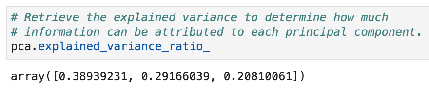
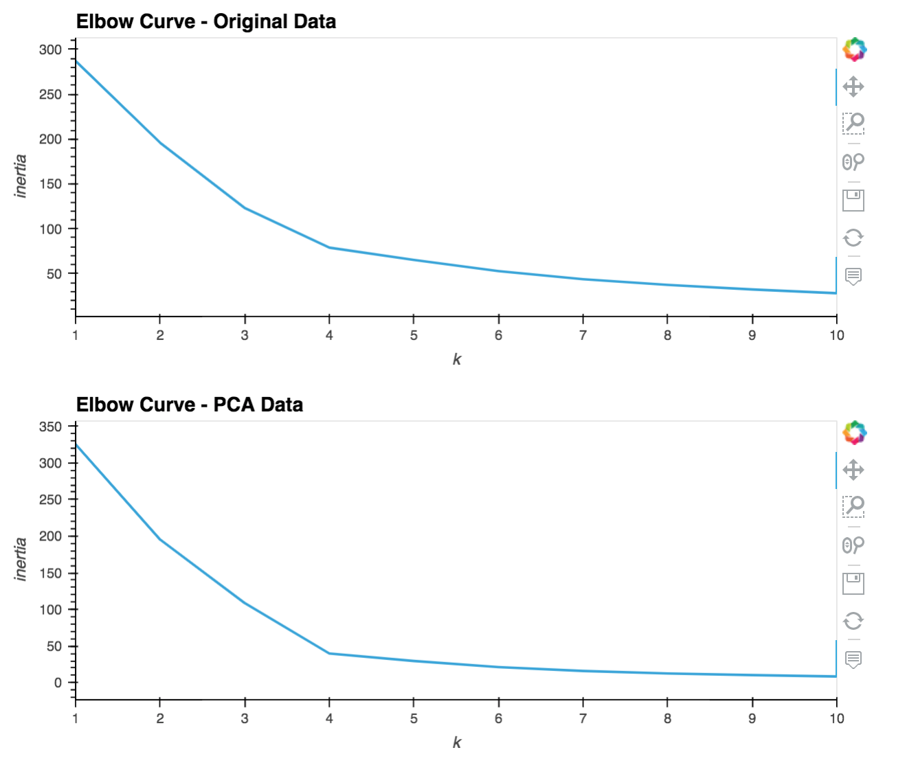
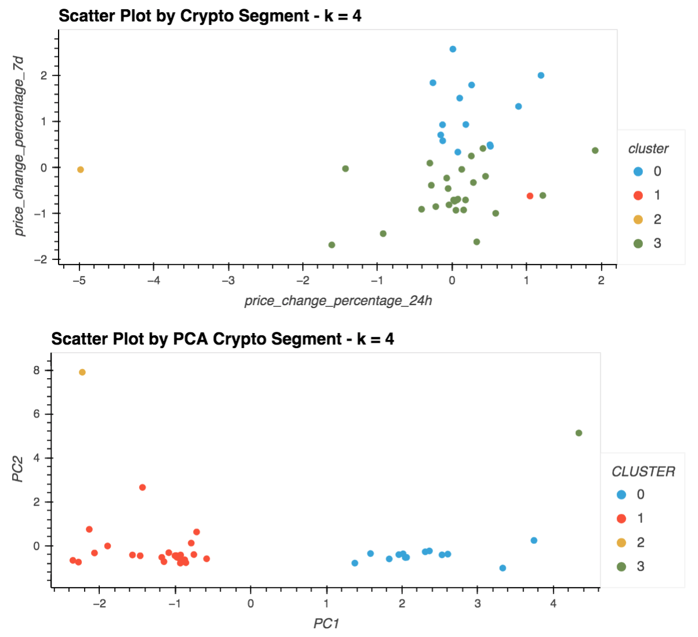

# Analyzing Cryptocurrency Portfolio Performace via KMeans Clustering

`This projects leverages Python and unsupervised learning techniques to cluster cryptocurrencies by their performance in different time periods.`

---

## Description


---

## Technologies

This project leverages python 3.7 with the following packages:

* [pandas](https://github.com/pandas-dev/pandas) - For reading data into a DataFrame.

* [hvplot](https://pypi.org/project/hvplot/) - For embedding interactive plots in the application.

* [pathlib](https://pypi.org/project/pathlib2/) - For object-oriented file paths.

* [scikit-learn](https://pypi.org/project/scikit-learn/) - A set of python modules for machine learning and data mining.

* [KMeans](https://scikit-learn.org/stable/modules/clustering.html#k-means) - An algorithm that clusters data into groups in a way which acheives minimal inertia.

* [PCA](https://scikit-learn.org/stable/modules/unsupervised_reduction.html#pca-principal-component-analysis) - A function for unsupervised dimensionality reduction that looks for a combination of features which sufficiently represent the variance of the original features.

* [StandardScaler](https://scikit-learn.org/stable/modules/preprocessing.html#standardization-or-mean-removal-and-variance-scaling) - A way to normalize numeric data in a DataFrame.

---

## Installation Guide

Before running the application first install the following dependencies:

```python
  pip install pandas
  pip install hvplot
  pip install pathlib2
  pip install scikit-learn
```

---

## Usage

To use the Crypto Performance Clustering aplication:

1. Locally clone the crypto_performance_clustering repository from GitHub using the following link:

```python
git clone https://github.com/elliotlozano/crypto_performance_clustering.git
```

2. Run the [Crypto Performance Clustering](crypto_investments.ipynb) program.

3. Examine the plots and review the commentary describing the significance of the results.

---

## Findings

The following visuals helped evaluate the union members' portfolios.


`analysis`


`analysis`


`analysis`

---

## Contributors

Elliot Lozano

[E-mail](elliotlozano95@gmail.com)

---

## License

MIT


